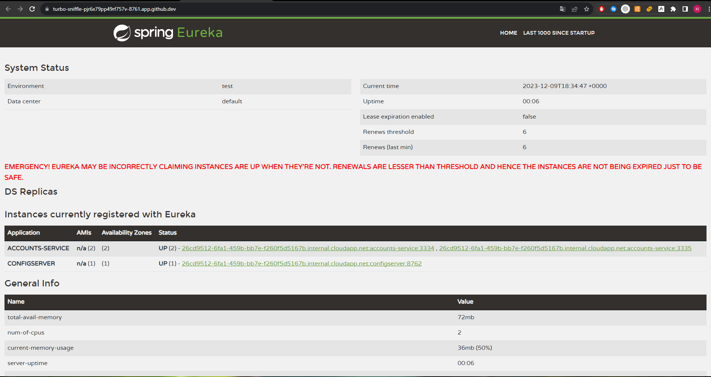

# Lab Assignment Guide 2023-2024

Welcome to the third assignment of the 2023-2024 course.
This guide will walk you through the steps to complete the assignment efficiently.
While this guide is command-line oriented, you are free to use IDEs like **VS Code**, **IntelliJ IDEA**, or **Eclipse**,
which have full support for the tools we are going to use.
Ensure that you have at least **Java 17** installed on your system.

## Getting Started

### Clone the Repository

1. Begin by cloning the assignment repository to your local machine:

    ```bash
    git clone https://github.com/UNIZAR-30246-WebEngineering/lab-3-web-api-<your-github-user>.git
    cd lab-3-web-api-<your-github-user>
    ```

2. Make changes to the files, commit the changes to the history and push the branch up to your repository.

    ```bash
    git push origin main
    ```

### Test the Server

If you wish to test the server locally, utilize the following command:

```bash
./gradlew bootRun
```

## Primary task

- Test if the system is resilient.

## Microservices infrastructure

The code is based on the post [microservices with Spring](https://spring.io/blog/2015/07/14/microservices-with-spring)
developed by [Paul Chapman](https://github.com/paulc4). The laboratory shows a simple example of setting up
a [microservices](http://martinfowler.com/articles/microservices.html) system using Spring Boot and Eureka. This project
contains three apps:

- **Service discovery** (`discovery` written in Kotlin):
  It launches an open source discovery server called [Eureka](https://github.com/Netflix/eureka) that will use the port
  `8761`. The dashboard of the registration server is exposed in `http://localhost:8761`.

  ```bash
  ./gradlew discovery:bootRun
  ```

- **Service config** (`config` written in Kotlin):
  It launches an open source config server called that will use the port `8762`.
  It provides the configuration for the other services. 
  The configuration is stored in the `https://github.com/UNIZAR-30246-WebEngineering/lab6-microservices-config-repo/` 
  git repository.

  ```bash
  ./gradlew config:bootRun
  ```
- 
- **Account service** (`accounts` written in Kotlin):
  It is a standalone process that provides a RESTful server to a repository of accounts that will use the port 2222.
  What it makes special is that it registers itself to Eureka with the name `ACCOUNTS-SERVICE` and uses
  the configuration provided by the Service config which is also discovered through Eureka. After launching this
  service you can see in the dashboard of Eureka that after a few seconds (10-20 secs) the `ACCOUNTS-SERVICE` service
  appears.

  ```bash
  ./gradlew accounts:bootRun
  ```

- **Web service** (`web` written in Java):
  It is a standalone process that provides an MVC front-end to the application of accounts that will use the port 3333.
  What it makes special is that it registers itself to the Eureka with the name `WEB-SERVICE`, asks the Eureka where
  is the `ACCOUNTS-SERVICE` and uses the configuration provided by the Service config which is also discovered through 
  Eureka. Spring configures automatically an instance of `RestTemplate` for using the discovery service transparently!!!

  ```bash
  ./gradlew web:bootRun
  ```

## Steps required

The objective is to show that the following activities have been accomplished:

- Create your own configuration repository based on <https://github.com/UNIZAR-30246-WebEngineering/lab6-microservices-config-repo>
  and update the configuration of your service `config` to use it. **Link to the repository**.
- Two services `accounts (2222)` and `web` are running and registered (two terminals). **2 Log screenshot**.

*Terminal accounts:bootRun funcionanado con puerto 3333*

**FALTA CAMBIAR EL PUERTO A 3334 POR EJEMPLO Y VER QUE SE PUEDE LANZAR IGUALMNTE Y PORNER CAPTURA EN ESTE APARTADO**

- The service registration service has these two services registered (a third terminal). **Eureka dashboard screenshot**.
- Update the configuration repository so that the `accounts` service uses now the port 3333. **Link to the commit**.
- Run a second instance of the `accounts` service using the new configuration (a fourth terminals). What happens? **Explain and Eureka dashboard screenshot**
- What happens when you kill the service `accounts (2222)` and do requests to `web`?. **Explain and screenshots, including at least one Eureka dashboard screenshot** 
- Can the web service provide information about the accounts again?. Why? **Explain and screenshots, including at least one Eureka dashboard screenshot** 

The above steps must be documented in a brief report (`REPORT.md`).

## How to submit

Create a `REPORT.md` file in docs that proof or explains how you solved this lab.
