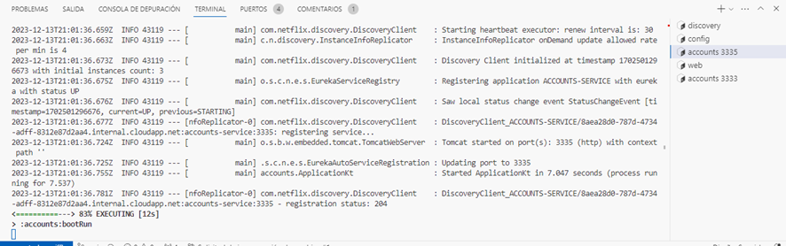

**Two services accounts (2222) and web are running and registered (two terminals). 2 Log screenshot.**

_Accounts 3335:_

_Web:_

 
**The service registration service has these two services registered (a third terminal). Eureka dashboard screenshot.**

_Eureka Dashboard:_

**Update the configuration repository so that the accounts service uses now the port 3333. Link to the commit.**

_Link:_ https://github.com/HectorArcega/lab6-microservices-config-repo/blob/main/accounts-service.yml

_Cambios en el repositorio:_

**Run a second instance of the accounts service using the new configuration (a fourth terminals). What happens? Explain and Eureka dashboard screenshot**

Ambas direcciones a los servicios accounts aparecen en Eureka, vemos que indica Accounts-service (2), uno con el puerto 3335 y otro con el puerto 3333.

**What happens when you kill the service accounts (2222) and do requests to web?. Explain and screenshots, including at least one Eureka dashboard screenshot**

Tras detener el servicio accounts 3335 Eureka se ha actualizado cambiando el accounts-service del 3335 al 3333 mostrando únicamente el servicio accounts que sigue activo (3333).

**Can the web service provide information about the accounts again?. Why? Explain and screenshots, including at least one Eureka dashboard screenshot**

Actualmente Eureka es capaz de proporcionar información sobre las cuentas debido a que ha permitido el cambio de lanzar el servicio accounts en el puerto 3335 al puerto 3333. En caso de que cambiemos de nuevo el puerto al 3335 pasaría lo mismo, cuando ambos servicios accounts estén en funcionamiento aparecerán en Eureka y cuando se mate al 3333, en Eureka aparecerá únicamente el 3335, indicando que el cambio se ha realizado correctamente sin perder el acceso a la información.

_Cambio a 3335 de nuevo:_

_Relanzamiento del accounts 3335:_

_Los dos accounts service:_

_Tras detener el accounts service del puerto 3333:_
