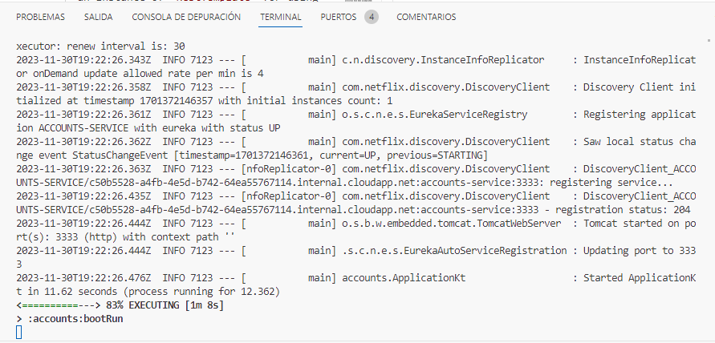

**2 Log screenshot**
Ejecutando accounts:bootRun en el puerto 3333:

Ejecutando accounts:bootRun en el puerto 3334:

**Eureka dashboard screenshot**

**Link to the commit**
uri: https://github.com/HectorArcega/lab6-microservices-config-repo

**Eureka dashborad screenshot**
Ejecutando accounts:bootRun en el puerto 3334 y 3335

El error que muestra significa que las "renovaciones" (latidos) son inferiores que el umbral definido y que Eureka no está eliminando las instancias que podrían no estar funcionando correctamente.

**Killing service in port 3334**

Ahora al no estar corriendo en el puerto 3334 y en el 3335 Eureka y ano muestra error y ha pasado a indicar en accounts-service unicamente el puerto 3335.

**Can the web service provide info about accounts again?**

No, ahora Eureka no es capaz de resolver el servicio accounts ya que inicialmente fue lanzado en el puerto 3334.